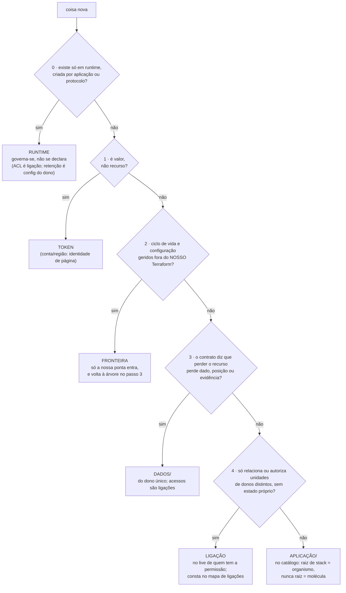

# Catálogo atômico de infraestrutura · como os módulos se organizam

## 1. Papel e escopo

Organiza os módulos Terraform e o live Terragrunt como o Storybook organiza componentes de interface: um catálogo com níveis de composição nomeados e um lugar separado onde as composições ganham dados reais. Sem escrever HCL ainda: taxonomia, critérios, organização de pastas e regras, como se os módulos já existissem. O caso de teste que guiou tudo: subir o o bloco do núcleo bancário da arquitetura de referência da instituição em produção com as dependências (fundação, rede, barramento, observabilidade, esteira).

Identidade honesta, para não prometer o que não entrega: isto é um padrão operacional sobre a divisão clássica `modules + live`. O que ele acrescenta: perguntas obrigatórias com ordem fixa (a árvore do §5), quatro nomes para os buracos onde `modules + live` vira discussão (runtime, fronteira, dados, ligação), dois mapas versionados que carregam os fatos, e regras que rodam como lint de CI com falha fechada. Capacidade técnica nova do Terraform não é alegada; o ganho é que a decisão de classificação deixa de depender de quem já sabe decidir.

## 2. A ideia, explicada por um exemplo de ponta a ponta

Uma analogia só (o Storybook) e um exemplo real do núcleo bancário seguido do começo ao fim: o consumo de comandos do barramento (a decisão de consumo por saga desse bloco). Cada nível aparece primeiro no exemplo, depois vira conceito.

**Átomo: um recurso, sozinho, inútil.** `aws_lambda_function` cria uma função. Só ela: sem permissão para ler o tópico, sem lugar para escrever log, sem alarme quando falha. Átomo é qualquer recurso que um provider Terraform sabe criar, da AWS ou de fora: uma função Lambda, um cluster RDS, um repositório no GitHub, um monitor no Datadog, um schema dentro de um Postgres. Duas respostas que este nível fixa:

- **Lambda e RDS têm o mesmo papel?** Sim, no nível de composição: os dois são átomos. A diferença entre eles (o RDS guarda dado que não volta; a função é descartável e recriável) importa em outro lugar: decide onde o recurso vai **morar** (`dados/` ou `aplicacao/`, §7), não o que ele **é** na composição.
- **E um Postgres fora da AWS?** Depende de quem gerencia o servidor. Se o servidor é de um fornecedor, ele é fronteira (§5, passo 2): não entra no catálogo. O que nós criamos **dentro** dele por provider (schema, role, grant) são átomos nossos, normais. O mesmo recurso lógico se divide na linha do que controlamos.

Ninguém escreve átomo: o provider entrega pronto. O catálogo começa no nível seguinte.

**Molécula: o menor conjunto que só faz sentido junto.** Ninguém sobe uma função de verdade sem a role dedicada, o log group e o alarme de erro. Esses quatro átomos formam a molécula `funcao-lambda`: nascem juntos, morrem juntos, e instanciar metade não tem uso. O teste para saber o que entra: **se dá para precisar de um sem o outro, não é da mesma molécula.** Por isso o tópico Kafka que a função consome fica fora (tem dono próprio: o barramento) e o segredo que ela lê fica fora (tem ciclo próprio: rotação). Molécula nunca vira stack sozinha; só existe composta dentro de um organismo.

**Organismo: a capacidade que aparece no desenho do bloco.** `consumo-saga` compõe a molécula `funcao-lambda` com o Event Source Mapping, a máquina de estados do Step Functions e o DLT: é a linha "consome comandos do barramento por saga" do bloco 05 virando uma unidade que se aplica de uma vez, com um dono e um state próprio. Organismo é o que o live instancia direto; é a receita de prateleira.

**Template e página: onde entram os valores.** Subir o consumo-saga em dev é criar uma pasta com um arquivo de dez linhas, sem nenhum Terraform:

```hcl
# live: nucleo-bancario/dev/aplicacao/consumo-saga/terragrunt.hcl
terraform {
  source = "git::<catalogo>//organismos/nucleo-bancario/consumo-saga?ref=v3.2.0"
}
inputs = {
  topico_comandos = "nucleo-bancario.comandos"
  memoria_mb      = 512
}
```

A pasta `nucleo-bancario/dev/` inteira, com todas as stacks assim, é o **template**; aplicada na conta de dev com os valores reais, é a **página**. Os valores (`topico_comandos`, `memoria_mb`, o CIDR da VPC) são os **tokens**: parametrizam tudo sem ter implementação própria, como a paleta de cores do Storybook.

O mapa completo, agora que o exemplo passou:

| Storybook | infraestrutura | no exemplo |
|---|---|---|
| paleta de cores (tokens) | valores de parametrização | `topico_comandos`, `memoria_mb`, CIDR |
| `<button>` cru | recurso de um provider (AWS ou não) | `aws_lambda_function` |
| campo com rótulo, erro e ajuda | menor conjunto que nasce e morre junto | `funcao-lambda` (função + role + logs + alarme) |
| cabeçalho completo | capacidade implantável, raiz de stack | `consumo-saga` |
| página sem conteúdo | pasta de ambiente no live | `nucleo-bancario/dev/` |
| página publicada | ambiente aplicado numa conta | núcleo bancário dev na conta de dev |

E onde a analogia termina, dito de frente: renderizar um botão é grátis, instantâneo e reversível; aplicar um banco custa dinheiro, demora e às vezes cria coisas que não se pode destruir (um livro-razão com lançamentos). Por isso o catálogo tem regime de teste por custo (§9) e nada muda fora de um PR com o plano da mudança visível.

O fluxo que importa guardar: **quem pede um ambiente novo não escreve infraestrutura.** Abre um PR com pastas de nomes e valores, como a de cima; o CI mostra o que vai nascer; o merge aplica. As receitas moram no catálogo, versionadas; o time escolhe qual instanciar e preenche os campos.

## 3. A taxonomia com os critérios finais

| nível | critério (o que sobreviveu aos 5 rounds) |
|---|---|
| token | valor de parametrização dentro de uma página. Mudar token é mudança estrutural (PR com plan: CIDR novo recria a VPC) |
| identidade de página | conta e região. Tokens não são: mudar significa criar página nova e migrar, nunca mutar a existente |
| átomo | recurso de qualquer provider Terraform, da AWS ou de fora (Lambda, RDS, repositório GitHub, schema num Postgres). Não se escreve nem se versiona. Natureza (guardar dado ou não) decide moradia, nunca nível |
| molécula | menor conjunto sob política de indivisibilidade **declarada no contrato e verificada por lint** (ex.: toda função tem role e log group dedicados). O que tem ciclo próprio de verdade sai da molécula e vira input por referência: compartilhado de verdade é recurso próprio. Molécula **nunca é raiz de stack** |
| organismo | **unidade de implantação**: raiz de stack (um `terragrunt.hcl` a instancia direto, com state próprio), sob um dono e um state que não mistura classes (donos diferentes, dados com aplicação). O critério molécula × organismo é estrutural e lintado: o live só dá `source` em `organismos/` e `ligacoes/` |
| template | pasta de composição no live, com grafo explícito (`dependency` + mock outputs) e **cardinalidade declarada**: ×ambiente (domínio), ×plano (plataforma), ×1 (fundação: Organization, landing zone) |
| página | template + identidade + tokens, aplicado |

Cada bloco de arquitetura ganha um **mapa serviço → unidade**: a tabela de Serviços do bloco é topologia lógica; a unidade de implantação é outra coluna (N:M documentado). A linha "Secrets Manager" do bloco 05 vira a molécula `segredo` dentro do organismo `ingestao-core`.

## 4. O que a árvore classifica (unidade, instante, falha fechada)

Três declarações que tornam a classificação determinística:

- **Unidade**: o recurso lógico de infraestrutura (endereço Terraform), observado no **plano de controle** (ciclo de vida e configuração). O plano de dados nunca entra: aplicação escrevendo no banco não muda a classe do banco, como usuário clicando no botão não muda o componente.
- **Instante**: a classificação lê o **contrato declarado**, não a ocupação. Ledger recém-criado e vazio já é `dados/`, porque o contrato declara persistência antes da primeira escrita. Recurso sem contrato de durabilidade declarado reprova no lint: falha fechada, não classificação improvisada.
- **Reclassificação é migração**: mudar o contrato (o cache que virou repositório de evidência) segue o mapa de migração (§11), antes da primeira escrita sob o novo regime.

## 5. A árvore de decisão

O primeiro "sim" decide; os passos seguintes nem são perguntados. A moradia (em qual live, com qual credencial) é sempre a segunda pergunta, respondida pelo mapa de donos (§6), nunca um ramo da árvore.



Notas de predicado, na letra que fechou o debate: o passo 2 dispara para terceiro e para serviço que se autogerencia (o interior do Control Tower); time interno com Terraform próprio **não** dispara (é moradia). O passo 3 vale desde a criação, vazio ou cheio; recurso compartilhado persistente (segredo, chave) é `dados/` de um dono único, e quem o acessa cria ligações. O passo 4 exige "sem estado próprio de valor": recriar devolve tudo (associação, regra, grant, policy).

## 6. Os dois mapas (onde moram os fatos)

Cada template mantém dois índices versionados ao lado do `env.hcl`:

- **mapa de donos**: recurso/stack → time dono → live onde mora → credencial que aplica. Dono da receita e conta de execução são eixos independentes: a Lambda de rotação que a segurança mantém roda na conta do domínio, mas a stack mora no live da segurança, com provider assumindo role.
- **mapa de ligações**: ligação → dono → o que relaciona → contrato. Quando duas esteiras teriam permissão de criar o mesmo recurso, o mapa fixa qual cria; o lint reprova a outra.

Divergência entre duas pessoas usando a árvore vira pergunta de fato ("quem é o dono?", "o contrato declara persistência?"), respondida pelos mapas. Lacuna no mapa se registra e se decide uma vez, no mapa, nunca caso a caso em PR.

## 7. Dado separa de aplicação

```
nucleo-bancario/dev/
├── dados/                    # o contrato declara: perder = perder conteúdo
│   ├── chaves/               # KMS do domínio; grants são ligações do dono da chave
│   ├── ledger/               # Aurora + pg_audit + DAS · backup por tag de opt-in
│   ├── topicos/              # tópicos, schemas, DLT (retenção é evidência)
│   └── controle/             # estados operacionais: checkpoint do DMS
└── aplicacao/                # nasce e morre com o ambiente
    ├── ingestao-core/        # DMS + molécula segredo
    ├── publicacao-ledger/    # MSK Connect (Debezium)
    ├── consumo-saga/         # Lambda ESM + Step Functions + DLT runtime
    └── borda-transacional/   # API privada + ponta da fronteira do vendor
```

A proteção de `dados/` é executável, e o motivo importa: proibir o comando destroy não protege nada, porque um `replace` (atributo ForceNew, bloco removido, chave de `for_each` alterada) destrói dentro de um apply normal. Toda esteira de `dados/` passa o JSON do plan por policy-as-code (OPA/conftest) que reprova `delete` e `replace` em classes protegidas, salvo annotation do workflow de encerramento aprovado. O efêmero (preview, homolog por candidato) aplica e destrói só `aplicacao/`, contra `dados/` de pé com seed sintético, que é o que [[15.2-esteira-ambientes]] §3 já manda.

## 8. Versionamento: tag única, fixada por template

- O catálogo versiona inteiro (`v3.2.0`): moléculas consumidas por organismos por caminho relativo no mesmo commit. Sem matriz de compatibilidade interna, sem cascata de republicação quando uma molécula muda. Sintaxe: `git::<repo>//organismos/nucleo-bancario/consumo-saga?ref=v3.2.0`.
- A tag é fixada **por template, num lugar só** (`env.hcl`), sem override por stack: stacks do mesmo template em tags diferentes executariam uma combinação que nenhuma tag certificou. Faseamento usa tag intermediária com feature flag (a mudança entra atrás de input na tag N+1, o template migra, a N+2 remove o flag).
- **Proveniência por release**: o estático (tier A) roda no catálogo inteiro sempre; os tiers com apply rodam nos diretórios alterados; a nota de release lista alterado × testado. A tag certifica o que a nota diz, e o que ela não certifica está escrito (§9).
- Higiene: tag imutável por proteção do servidor + digest do commit conferido pela esteira do live; release só pela esteira do catálogo; relatório contínuo de versões em uso com PR automático de atualização; janela de suporte N-2. Fora da janela ou com CVE bloqueante, a esteira do live **falha**, com exceção só por aprovação da plataforma com prazo.
- Ownership do catálogo: **núcleo** (plataforma: moléculas genéricas, fundação, rede, plataforma) e **extensões de domínio** (o time do domínio escreve os organismos que codificam a semântica dele, tipo `ledger-livro`; a plataforma revisa por CODEOWNERS). "You build it, you run it" vale no catálogo também.

## 9. Teste por tier e a cadeia de garantias

| tier | o que roda | quem |
|---|---|---|
| A · estático | validate + `terraform test` (mock) + lints do §10 | catálogo inteiro, todo PR |
| B · apply efêmero | exemplo (a "story") aplicado e destruído em sandbox | receita barata e destrutível |
| C · ensaio | apply em ambiente dedicado, agendado, com teto de custo | receita cara (MSK, VPC com attachment) |
| D · ensaio de singleton | Organization de ensaio **mantida** (criada uma vez, manual; decomission entre ensaios; runbook de limpeza; equivalência documentada) | landing zone, Identity Center; só mudança maior |

Cadeia de garantias, cada elo com o alcance dito: a **tag** certifica a receita; o **plan dos 3 ambientes no PR do live** certifica a combinação estática, produção incluída ([[implementacao-terragrunt]] §8); o **apply de dev e homolog** certifica comportamento; quota, SCP e vizinhança de produção só o apply de produção revela, e por isso existem o portão do dono e o rollback automático ([[15.2-esteira-ambientes]]). Nenhum elo promete o alcance do seguinte.

Contrato agora, interior sob demanda, sem tag vazia: receita planejada é ficha no índice do catálogo (`status: planejada`, com inputs/outputs/tier/dono); código, exemplo e primeira tag só quando o primeiro template instancia. E parâmetro não troca tecnologia: interior com operação distinta é receita irmã (`gitops-flux`, `gitops-argo`); parâmetro cobre tamanho e feature (`com_proxy` no `banco-aurora`).

## 10. Lints executáveis

Regra sem lint é prosa. Cada uma com mecanismo, exceção versionada e teste negativo no repo do catálogo; todas falham fechado:

| regra | mecanismo | exceção |
|---|---|---|
| live sem bloco `resource` | análise do HCL (regra tflint própria) no CI do live | nenhuma |
| live só dá `source` em `organismos/` e `ligacoes/` | verificação de caminho no CI do live | nenhuma |
| catálogo sem identidade (conta, ARN com conta, região fixa) | varredura AST + regex sobre HCL e JSON embutido | lista versionada aprovada (principals de serviço) |
| `dados/` sem delete/replace | OPA/conftest sobre o JSON do plan | annotation do workflow de encerramento |
| política de molécula (role/log dedicados etc.) | conftest sobre o plan do exemplo nos tiers A/B | registrada no contrato da receita |
| recurso sem contrato de durabilidade | lint de contrato no catálogo | nenhuma |
| mesmo ARN em dois states | verificação no relatório de states | período de migração com mapa aprovado |
| tag imutável e proveniente | proteção do servidor + digest conferido pela esteira do live | nenhuma |

## 11. Break-glass e migração

**Break-glass**: o caminho permanente é PR; mudança manual só sob incidente declarado, com identidade segregada (JIT, MFA, dupla aprovação), sessão gravada, vínculo com o ticket e detecção de drift em minutos como pré-condição. O SLA de reconciliação é por classe de risco, anexo do processo de gestão de mudança do cliente (dono: cliente): exposição de rede ou identidade tem expiração automática (TTL com auto-revert em horas); correção contida reconcilia no dia útil seguinte; mudança em singleton segue plano do comitê. Nenhum número fixo universal.

**Migração de recurso persistente** (adoção de legado, mudança de endereço, reclassificação): nunca recriar para caber na taxonomia. O mapa de migração por recurso traz endereço origem → destino (`import`/`moved`), a mudança de configuração aplicada junto e o **plano de reversão explícito por recurso** (re-import no endereço anterior + PR reverso da configuração), ensaiado antes do corte. Restaurar state não desfaz recurso remoto: state versionado é diagnóstico, nunca mecanismo de desfazer. Dono único por ARN durante toda a movimentação (lint do §10).

**O chão**: o seed (conta management, credencial temporária, `terragrunt backend bootstrap`) precede o catálogo e mora em [[implementacao-fundacao]] §3. A taxonomia cobre do primeiro recurso aplicado por PR em diante.

## 12. O inventário do caso de teste (como se os módulos já existissem)

```
catalogo/                                # Terraform puro · UMA tag por release
├── moleculas/                           # nunca são raiz de stack
│   ├── funcao-lambda/  banco-aurora/  topico-kafka/  api-privada/  segredo/
│   ├── conta/  ou-registrada/  scp/
│   └── observabilidade-recurso/         # telemetria e alarmes DO recurso (defaults do módulo-base)
├── organismos/                          # raízes de stack
│   ├── fundacao/    landing-zone/  arvore-ous/  identity-center/     (template ×1)
│   ├── rede/        vpc-dominio/  hub-planos/  vpn-acesso/
│   ├── plataforma/  msk-barramento/  observabilidade-central/  esteira-oidc/
│   └── nucleo-bancario/                    # extensão de domínio (CODEOWNERS do domínio)
│       ├── ledger-livro/  publicacao-ledger/  ingestao-core/
│       ├── borda-transacional/          # a nossa ponta da fronteira do vendor
│       └── consumo-saga/
└── ligacoes/                            # relacionam donos distintos, sem estado próprio
    ├── associacao-tgw/  grant-kms/  regra-sg-prefixlist/  policy-recurso/

live/                                    # Terragrunt · conhece conta e ambiente
├── fundacao/         (template ×1: 00-organization → 07-identity-center)
├── rede/             (hub, planos, vpn + as ligações de associação)
├── plataforma/       (barramento ×plano, observabilidade, esteira)
└── nucleo-bancario/     (template ×ambiente)
    ├── terragrunt.hcl  contas.hcl  env.hcl (a tag do catálogo mora aqui)
    ├── mapa-donos.md   mapa-ligacoes.md
    ├── dev/      dados/{chaves,ledger,topicos,controle} + aplicacao/{...}
    ├── homolog/  (as mesmas stacks; o efêmero só toca aplicacao/)
    └── prod/     (as mesmas stacks)
```

Casos de uso que a estrutura resolve: subir tudo do zero (fundação ×1, depois plataforma, depois domínio, na ordem de [[implementacao-fundacao]] §9); subir um domínio novo (copiar o template: contas na fundação, attachment na rede, pasta nova); subir uma stack nova (uma pasta com `terragrunt.hcl` de dez linhas apontando organismo por tag); homolog efêmero (aplicar e destruir `aplicacao/`).

## 13. Treze casos classificados (os que tentaram derrubar a árvore)

| caso | passo | resposta |
|---|---|---|
| RDS Proxy | 5 | input `com_proxy` do `banco-aurora` (mesmo dono e ciclo) |
| VPC endpoint do API GW privado | 5 | recurso do `vpc-dominio`; `api-privada` recebe por input |
| associação de TGW | 4 | ligação no live da rede (relaciona attachment do domínio à route table da rede) |
| chave KMS de Aurora+DMS+logs | 3 | `dados/chaves/` do domínio; grants são ligações do dono da chave |
| DNS do ambiente efêmero | 5 | stack da camada `aplicacao/` (a esteira registra na zona wildcard) |
| secret do core externo | 5 | molécula `segredo` dentro de `ingestao-core` |
| AWS Backup do ledger | 2 | fronteira interna: o plano é do organismo central; o `ledger/` só carrega a tag de opt-in |
| policy IAM entre organismos | 4 | ligação; identity policy no dono do caller, resource policy no dono do recurso; os dois = duas ligações |
| secret compartilhado por dois domínios | 3 | `dados/` do dono único (mapa de donos); os acessos dos dois são ligações |
| Lambda de rotação da segurança na conta do domínio | 5 | organismo (extensão da segurança); mora no live da segurança, provider na conta do domínio |
| bucket de artefatos da esteira | 3 | o contrato declara evidência de entrega → `dados/` da plataforma (cache reconstruível declarado cairia no 5) |
| regra de SG com prefix list da rede | 4 | ligação no live do domínio dono do SG; a prefix list segue da rede |
| consumer group do Kafka | 0 | runtime: a ACL é ligação; retenção de offsets é config do tópico em `dados/` |
| Postgres fora da AWS, servidor do fornecedor | 2 | o servidor é fronteira; schemas, roles e grants que criamos dentro por provider são átomos nossos e classificam normalmente (o schema com dado contratado cai no 3) |

E os três da última rodada: ledger vazio é `dados/` desde a criação (contrato, não ocupação); RDS com escrita da aplicação segue nosso (plano de controle); conta é três coisas com três nomes (o recurso de vending é organismo da fundação com contrato próprio, o id é identidade de página, o template aplicado é a página; os descendentes respondem por si).

## 14. Gates de implementação (as ressalvas do veredito)

O framework segue o próprio princípio: contrato agora, adoção só com o interior pronto. Entrada em operação bloqueada por:

1. Lints do §10 implementados com testes negativos. Dono: plataforma.
2. OPA de delete/replace sobre o plan de `dados/`. Dono: plataforma.
3. Mapas de donos e ligações materializados nos templates. Dono: plataforma + domínios.
4. Matriz de risco e SLAs do break-glass fechados com a gestão de mudança do cliente. Dono: cliente + segurança.
5. Regime do tier D operado (dono, cadência, orçamento, baseline, runbook). Dono: plataforma; depende da pendência de sandbox de [[implementacao-fundacao]] §14.
6. Reversão por recurso ensaiada antes de qualquer migração de persistente. Dono: plataforma.

## 15. Mapa: decisão → seção

| decisão | seção aqui |
|---|---|
| [[15-devsecops-plataforma#Decisão 1 · Paved road como produto de plataforma]] | §1, §8 (núcleo e extensões) |
| [[15.2-esteira-ambientes]] §3 (efêmero sobre base de pé) e §4 (IaC na matriz) | §7, §9, §12 |
| [[implementacao-comum]] §11 (divisão de estado, boundary por SSM) | §5 passo 4, §6 |
| [[implementacao-terragrunt]] (trilhos, promoção por versão, plan dos 3 ambientes) | §8, §9, §12 |
| [[implementacao-fundacao]] (seed, sequência, sandbox) | §11, §12, §14 |
| [[_registro/estresse-catalogo-atomico-2026-07-29]] (o debate que moldou tudo) | todas |
